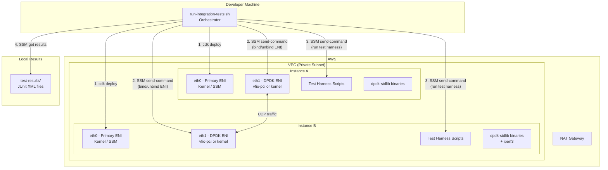
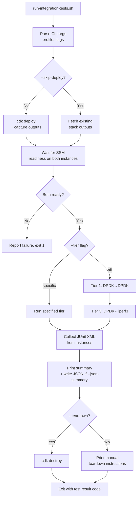

# Design Document: EC2 Integration Tests

## Overview

This design describes an automated integration testing system for dpdk-stdlib-rust that provisions EC2 infrastructure, executes multi-tier network tests remotely via SSM, and produces structured JUnit XML results. The system is composed of four layers:

1. **Orchestrator** (`scripts/run-integration-tests.sh`) — a local Bash script that drives the full lifecycle: deploy, wait, configure ENIs, run tests, collect results, optionally teardown.
2. **CDK Stack** (`deploy/cdk/lib/dpdk-test-stack.ts`) — the existing AWS CDK infrastructure, extended to export the private IPs of DPDK ENIs and install iperf3.
3. **Test Harness** (`scripts/integration-tests/`) — a set of Bash scripts deployed to instances as part of the project that execute individual test scenarios and emit JUnit XML.
4. **CI Workflow** (`.github/workflows/integration-tests.yml`) — a GitHub Actions workflow that runs the orchestrator on PRs, uploads JUnit XML artifacts, and reports results in the PR checks UI.

The key design decisions are:
- All three test tiers reuse the same two-instance infrastructure. The orchestrator reconfigures ENI bindings between tiers rather than provisioning separate environments.
- The same orchestrator script is used by developers locally, by GitHub Actions, and by AI agents. The `--json-summary` flag adds machine-readable output for agent consumption.
- Infrastructure is always torn down after CI runs (`--teardown`) to minimize costs.

## Architecture



### Orchestrator Flow



## Components and Interfaces

### Component 1: Orchestrator Script (`scripts/run-integration-tests.sh`)

**Responsibilities:**
- Parse CLI arguments (AWS_PROFILE, --teardown, --skip-deploy, --tier)
- Drive CDK deployment and capture stack outputs (instance IDs, ENI IDs, ENI private IPs)
- Wait for SSM readiness on both instances with configurable timeout
- Configure ENI bindings per tier via SSM send-command
- Execute test harness scripts on instances via SSM send-command
- Retrieve JUnit XML results from instances via SSM
- Merge results into local `test-results/` directory
- Print human-readable summary
- Optionally run `cdk destroy`

**Interface:**
```bash
# Usage
./scripts/run-integration-tests.sh <AWS_PROFILE> [--teardown] [--skip-deploy] [--tier 1|3] [--json-summary]

# Exit codes
# 0 = all tests passed
# 1 = one or more tests failed
# 2 = infrastructure/setup failure
```

When `--json-summary` is passed, the orchestrator writes `test-results/summary.json` after collecting results.

**SSM Interaction Pattern:**
The orchestrator uses `aws ssm send-command` with `AWS-RunShellScript` document for all remote operations. Each command:
1. Sends the script content inline or references a script path on the instance
2. Polls `aws ssm get-command-invocation` until completion or timeout
3. Captures stdout/stderr from the invocation result
4. For result retrieval, uses SSM send-command to cat the XML file content to stdout which gets captured

### Component 2: CDK Stack Extensions

**Changes to existing `deploy/cdk/lib/dpdk-test-stack.ts`:**
- Add `iperf3` to the user data install commands
- Add CDK outputs for DPDK ENI private IP addresses (needed for test traffic routing)
- Widen the DPDK security group to allow all UDP traffic between instances (not just port 9000) since iperf3 uses dynamic ports

**New CDK Outputs:**
```
SenderDpdkEniPrivateIp   - Private IP of Instance A's DPDK ENI
ReceiverDpdkEniPrivateIp - Private IP of Instance B's DPDK ENI
SenderInstanceId         - (existing) Instance A ID
ReceiverInstanceId       - (existing) Instance B ID
SenderDpdkEniId          - (existing) Instance A DPDK ENI ID
ReceiverDpdkEniId        - (existing) Instance B DPDK ENI ID
```

### Component 3: Test Harness Scripts (`scripts/integration-tests/`)

A directory of Bash scripts that live in the repo and get deployed to instances as part of the project asset. Each script handles one test scenario and produces JUnit XML.

**Scripts:**

| Script | Purpose | Runs On |
|--------|---------|---------|
| `harness-common.sh` | Shared functions: JUnit XML generation, timeout handling, logging | Both |
| `tier1-dpdk-echo.sh` | Tier 1: DPDK↔DPDK echo + payload verification | Both (different roles) |
| `tier3-iperf-interop.sh` | Tier 3: DPDK↔iperf3 bidirectional test | Both (different roles) |

**Harness Common Interface:**
```bash
# JUnit XML helper functions
junit_start_suite <suite_name> <test_count>
junit_add_pass <test_name> <classname> <time_seconds>
junit_add_failure <test_name> <classname> <time_seconds> <message> <details>
junit_end_suite
junit_write <output_path>

# Test execution helpers
run_with_timeout <timeout_seconds> <command...>
log_info <message>
log_error <message>
```

**Tier 1 Script Interface:**
```bash
# On Instance B (listener):
./scripts/integration-tests/tier1-dpdk-echo.sh \
    --role listener \
    --bind-ip <DPDK_ENI_IP_B> \
    --port 9000

# On Instance A (sender):
./scripts/integration-tests/tier1-dpdk-echo.sh \
    --role sender \
    --bind-ip <DPDK_ENI_IP_A> \
    --peer-ip <DPDK_ENI_IP_B> \
    --port 9000 \
    --output /tmp/test-results/tier1-dpdk-echo.xml
```

**Tier 3 Script Interface:**
```bash
# Direction 1: our-app-sends
# On Instance B: start iperf3 server
# On Instance A: run dpdk-stdlib sending to Instance B

# Direction 2: iperf-sends
# On Instance A: start dpdk-stdlib listener
# On Instance B: run iperf3 client sending to Instance A

./scripts/integration-tests/tier3-iperf-interop.sh \
    --role <server|client> \
    --direction <our-app-sends|iperf-sends> \
    --local-ip <DPDK_ENI_IP> \
    --peer-ip <PEER_DPDK_ENI_IP> \
    --port 9000 \
    --output /tmp/test-results/tier3-iperf-interop.xml
```

### Component 4: ENI Configuration Helper (`scripts/integration-tests/configure-eni.sh`)

Wraps the existing `bind_eni.sh` and `unbind_eni.sh` scripts with idempotency and status checking.

```bash
./scripts/integration-tests/configure-eni.sh --action <bind|unbind|status>
# bind   - bind secondary ENI to vfio-pci for DPDK
# unbind - return secondary ENI to kernel ena driver
# status - report current binding state
```

### Component 5: GitHub Actions CI Workflow (`.github/workflows/integration-tests.yml`)

A GitHub Actions workflow that runs integration tests on pull requests. The workflow uses the same orchestrator script that developers use locally, with `--teardown` to ensure infrastructure is always cleaned up.

**Workflow Structure:**
```yaml
name: Integration Tests
on:
  pull_request:
    branches: [main]
  workflow_dispatch: {}

jobs:
  integration-tests:
    runs-on: ubuntu-latest
    timeout-minutes: 45
    permissions:
      id-token: write
      contents: read
      checks: write
    steps:
      - checkout
      - configure AWS credentials (OIDC or secrets)
      - install CDK + session-manager-plugin
      - run orchestrator with --teardown --json-summary
      - upload test-results/ as artifact
      - publish JUnit XML via test reporter action
      - teardown on failure (ensure cleanup even if orchestrator crashes)
```

### Component 6: JSON Summary Generator

A function within the orchestrator that parses collected JUnit XML files and produces `test-results/summary.json`. This is the primary interface for agent consumption.

**Implementation:**
The generator uses `grep` and `sed` to extract attributes from JUnit XML (no external XML parser dependency). It:
1. Iterates over all `*.xml` files in `test-results/`
2. Extracts `<testsuite>` attributes (name, tests, failures, time)
3. Extracts `<testcase>` elements with their status and any `<failure>` messages
4. Computes aggregate totals
5. Adds metadata: commit hash (`git rev-parse HEAD`), timestamp, infrastructure details
6. Writes JSON to `test-results/summary.json`

## Data Models

### JUnit XML Schema

The test harness produces JUnit XML conforming to this structure:

```xml
<?xml version="1.0" encoding="UTF-8"?>
<testsuite name="tier1-dpdk-echo" tests="4" failures="1" errors="0" time="12.345">
    <testcase name="arp_resolution" classname="tier1.dpdk_echo" time="2.100">
    </testcase>
    <testcase name="udp_send_receive" classname="tier1.dpdk_echo" time="3.200">
    </testcase>
    <testcase name="echo_roundtrip" classname="tier1.dpdk_echo" time="4.500">
    </testcase>
    <testcase name="payload_integrity" classname="tier1.dpdk_echo" time="2.545">
        <failure message="Payload mismatch" type="AssertionError">
            Expected: 48656c6c6f20445044
            Actual:   48656c6c6f20000000
            Bytes differ at offset 6
        </failure>
    </testcase>
</testsuite>
```

### JSON Summary Schema (Agent-Legible Output)

When `--json-summary` is passed, the orchestrator writes `test-results/summary.json`:

```json
{
  "run_id": "a1b2c3d4",
  "commit": "deadbeef1234567890",
  "timestamp": "2025-07-14T12:00:00Z",
  "infrastructure": {
    "instance_type": "c5n.large",
    "dpdk_version": "22.11.6",
    "region": "us-east-1"
  },
  "tiers": [
    {
      "name": "tier1-dpdk-echo",
      "status": "pass",
      "tests": [
        {
          "name": "arp_resolution",
          "classname": "tier1.dpdk_echo",
          "status": "pass",
          "duration_seconds": 2.1,
          "error": null
        }
      ]
    }
  ],
  "summary": {
    "total": 8,
    "passed": 7,
    "failed": 1,
    "total_time_seconds": 45.2
  }
}
```

### CDK Stack Outputs Model

The orchestrator parses CDK stack outputs as key-value pairs:

| Key | Type | Example |
|-----|------|---------|
| `SenderInstanceId` | string | `i-0abc123def456` |
| `ReceiverInstanceId` | string | `i-0def789abc012` |
| `SenderDpdkEniId` | string | `eni-0abc123def456` |
| `ReceiverDpdkEniId` | string | `eni-0def789abc012` |
| `SenderDpdkEniPrivateIp` | string | `10.0.1.50` |
| `ReceiverDpdkEniPrivateIp` | string | `10.0.1.100` |

### Orchestrator Configuration

Timeouts and configuration are defined as constants at the top of the orchestrator script:

```bash
SSM_READINESS_TIMEOUT=600    # 10 minutes to wait for SSM
TEST_TIMEOUT=120             # 2 minutes per test scenario
ENI_BIND_TIMEOUT=30          # 30 seconds for ENI bind/unbind
RESULTS_DIR="test-results"   # Local directory for collected results
RESULTS_REMOTE_DIR="/tmp/test-results"  # Remote directory on instances
```

## Correctness Properties

Most of this feature is infrastructure orchestration (CDK, SSM, ENI binding) that can only be validated on real AWS hardware. The testable surface is concentrated in the JUnit XML generation layer and the orchestrator's result aggregation logic — these are pure functions that transform inputs to outputs without side effects.

### Property 1: JUnit XML structural validity

*For any* set of test case results (each with a name, classname, duration, and pass/fail status), the generated JUnit XML SHALL be well-formed XML containing exactly one `<testsuite>` root element, with the `tests` attribute equal to the number of test cases, and the `failures` attribute equal to the number of failed test cases.

**Validates: Requirements 7.1**

### Property 2: JUnit XML pass element completeness

*For any* passing test case with a given name, classname, and duration, the generated `<testcase>` element SHALL contain the `name`, `classname`, and `time` attributes with the provided values, and SHALL NOT contain a `<failure>` child element.

**Validates: Requirements 7.2**

### Property 3: JUnit XML failure element completeness

*For any* failing test case with a given name, classname, duration, and failure message, the generated `<testcase>` element SHALL contain a `<failure>` child element whose `message` attribute matches the provided failure message, and the failure element body SHALL contain the provided detail text.

**Validates: Requirements 7.3**

### Property 4: Summary counts match JUnit XML content

*For any* collection of JUnit XML files, the human-readable summary SHALL report a total test count equal to the sum of all `tests` attributes, a failure count equal to the sum of all `failures` attributes, and a pass count equal to total minus failures.

**Validates: Requirements 7.5**

### Property 5: Exit code reflects aggregate test results

*For any* combination of tier results (each either pass or fail), the orchestrator exit code SHALL be 0 if and only if all tiers passed, and non-zero if any tier failed.

**Validates: Requirements 1.5**

### Property 6: Teardown failure preserves test exit code

*For any* test result exit code and a teardown operation that fails, the final orchestrator exit code SHALL equal the test result exit code, not a teardown-specific error code.

**Validates: Requirements 9.3**

### Property 7: Deterministic output path generation

*For any* tier name and scenario name, the output file path SHALL follow the pattern `/tmp/test-results/<tier>-<scenario>.xml`, and the same inputs SHALL always produce the same path.

**Validates: Requirements 8.3**

### Property 8: JSON summary consistency with JUnit XML

*For any* collection of JUnit XML files in `test-results/`, the generated `summary.json` SHALL contain the same total test count, failure count, and per-test status as the source XML files. The summary's `passed` count SHALL equal `total` minus `failed`.

**Validates: Requirements 11.1, 11.2, 11.4**

## Error Handling

### Orchestrator Errors

| Error Condition | Behavior | Exit Code |
|----------------|----------|-----------|
| Missing AWS_PROFILE argument | Print usage, exit immediately | 2 |
| CDK deployment failure | Print CDK error output, exit | 2 |
| SSM readiness timeout | Report which instance(s) failed, exit | 2 |
| ENI bind/unbind failure | Report error, skip affected tier, continue | 1 (if any tier skipped) |
| SSM send-command timeout | Record test as failed in JUnit XML, continue | 1 |
| SSM send-command failure | Record test as failed in JUnit XML, continue | 1 |
| Result retrieval failure | Generate failure JUnit XML locally, continue | 1 |
| CDK teardown failure | Report error, exit with test result code (not teardown code) | test result code |

### Test Harness Errors

| Error Condition | Behavior |
|----------------|----------|
| Test process timeout | Kill process, record timeout failure in JUnit XML |
| Test process crash (non-zero exit) | Capture stderr, record crash failure in JUnit XML |
| Application binary not found | Record setup failure in JUnit XML |
| Network unreachable | Record connectivity failure in JUnit XML |

### Design Principle: Never Lose Results

The system follows a "never lose results" principle:
- If a test fails, the failure is recorded in JUnit XML — never silently dropped
- If result retrieval fails, a synthetic failure XML is generated locally
- If teardown fails, test results are still reported
- The orchestrator always attempts to collect and report whatever results are available

## Testing Strategy

### What Can Be Tested Locally (Without AWS)

The JUnit XML generation functions (`harness-common.sh`) are pure Bash functions that take inputs and produce XML strings. These can be tested locally:

1. **Property-based tests** for JUnit XML generation (Properties 1-3):
   - Use a property-based testing library to generate random test names, classnames, durations, and pass/fail statuses
   - Verify the generated XML is well-formed and contains the expected elements
   - Library: [bats-core](https://github.com/bats-core/bats-core) for Bash testing, with a custom property-based test driver that generates random inputs

2. **Property-based tests** for summary aggregation (Property 4):
   - Generate random collections of JUnit XML files
   - Verify the summary counts match

3. **Unit tests** for CLI argument parsing, exit code logic, output path generation

### What Requires Real AWS (Integration Tests)

The actual integration tests (Tiers 1 and 3) require real EC2 instances and can only be validated by running the full orchestrator. These are the tests the harness itself runs — they ARE the tests.

### Testing Framework

- **Bash tests**: [bats-core](https://github.com/bats-core/bats-core) for testing shell script functions
- **Property-based testing**: Custom Bash driver using `$RANDOM` and loops to generate varied inputs for JUnit XML generation tests. Each property test runs a minimum of 100 iterations.
