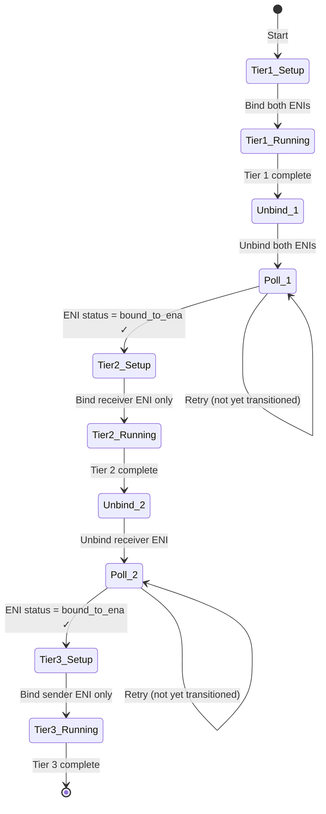
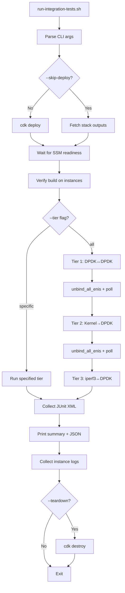

# Integration Test Fixes - Bugfix Design

## Overview

The integration test suite has three interrelated bugs that collectively mean the project has zero validation of its core DPDK-to-DPDK userspace networking path and a broken CI pipeline. The test-client uses `tokio::net::UdpSocket` (kernel networking) instead of `dpdk_tokio::compat::tokio::UdpSocket`, hardcodes `bind("0.0.0.0:0")` routing traffic through the management interface, and the orchestrator has ENI state transition race conditions that cause Tier 3 to fail. Additionally, no Tier 2 (Kernel→DPDK) test exists, and the orchestrator doesn't support `--tier 2`.

The fix strategy is minimal and targeted:
1. Fix the test-client import and add `--bind-ip` CLI argument (2 files changed)
2. Add ENI state polling after unbind operations to prevent race conditions
3. Create a Tier 2 test script and wire it into the orchestrator
4. Update the orchestrator to accept `--tier 2`

## Glossary

- **Bug_Condition (C)**: The set of conditions that cause incorrect test behavior — test-client using kernel sockets, hardcoded bind address, ENI state races, missing tier 2
- **Property (P)**: The desired behavior — test-client uses DPDK sockets when bound to DPDK interface, binds to specified IP, ENI transitions complete before next tier starts
- **Preservation**: Existing behavior that must remain unchanged — backward-compatible default bind, JUnit XML structure, `--tier 1` and `--tier 3` support, local `cargo build && cargo test`
- **test-client**: The UDP test client binary at `apps/test-client/src/main.rs` that sends packets to the echo server and verifies responses
- **configure-eni.sh**: The ENI bind/unbind/status wrapper at `scripts/integration-tests/configure-eni.sh` that manages DPDK interface binding via vfio-pci
- **orchestrator**: The main test driver at `scripts/run-integration-tests.sh` that deploys infrastructure, configures ENIs, runs test tiers, and collects results

## Bug Details

### Fault Condition

The bug manifests across three related failure modes: (1) the test-client sends traffic via kernel networking instead of DPDK, (2) the test-client binds to the wrong interface, and (3) ENI state transitions between tiers race, causing Tier 3 to fail.

**Formal Specification:**
```
FUNCTION isBugCondition(input)
  INPUT: input of type TestExecution
  OUTPUT: boolean

  // Bug 1: Wrong socket implementation
  LET usesKernelSocket = input.testClient.importPath == "tokio::net::UdpSocket"

  // Bug 2: Wrong bind address
  LET usesWrongBind = input.testClient.bindAddress == "0.0.0.0:0"
                      AND input.intendedInterface == "dpdk_eni"

  // Bug 3: ENI race condition
  LET eniRace = input.previousTier.eniUnbound == true
                AND input.currentTier.eniBindAttempted == true
                AND input.eniTransitionComplete == false

  // Bug 4: Missing tier 2
  LET missingTier2 = input.requestedTier == 2
                     AND NOT orchestrator.supportsTier(2)

  RETURN usesKernelSocket OR usesWrongBind OR eniRace OR missingTier2
END FUNCTION
```

### Examples

- **Bug 1**: Tier 1 sender runs `test-client --target 10.0.1.165 --port 9000`. The test-client uses `tokio::net::UdpSocket` which sends via kernel networking. The receiver's echo server (DPDK) sees packets from 10.0.1.139 (management IP) instead of 10.0.1.193 (DPDK ENI IP). The test "passes" but validates Kernel→DPDK, not DPDK→DPDK.

- **Bug 2**: Tier 1 sender binds to `0.0.0.0:0`. The OS routes traffic through eth0 (management ENI, 10.0.1.139) because eth1 is bound to vfio-pci and invisible to the kernel. Even if the import were fixed, without binding to the DPDK ENI IP, traffic would still go through the wrong interface.

- **Bug 3**: After Tier 1 completes, `unbind_all_enis()` calls `configure_eni unbind` on both instances. The orchestrator immediately proceeds to Tier 3 which calls `configure_eni bind` on the sender. If the ENI hasn't fully transitioned from vfio-pci back to the ena driver, the bind attempt for Tier 3 fails with "ENI bind failed on sender instance".

- **Bug 4**: Running `./scripts/run-integration-tests.sh --tier 2` exits with error: `ERROR: --tier must be 1 or 3, got: 2`.

## Expected Behavior

### Preservation Requirements

**Unchanged Behaviors:**
- When `--bind-ip` is NOT provided, test-client binds to `0.0.0.0:0` (backward compatible)
- Echo server continues to echo packets correctly regardless of sender type
- Tier 1 JUnit XML test case names remain: `arp_resolution`, `udp_send_receive`, `echo_roundtrip`, `payload_integrity`
- `--tier 1` and `--tier 3` continue to work as CLI arguments
- `cargo build && cargo test` passes locally without DPDK installed (stubs)
- CI workflow uses the same orchestrator entry point and argument format

**Scope:**
All inputs that do NOT involve the four bug conditions should be completely unaffected by this fix. This includes:
- Echo server behavior (not modified)
- JUnit XML generation functions in `harness-common.sh` (not modified)
- CDK infrastructure stack (not modified)
- SSM command execution helpers (not modified)
- Result collection and summary generation (not modified)

## Hypothesized Root Cause

Based on code analysis of the actual source files:

1. **Wrong Socket Import** (`apps/test-client/src/main.rs:2`): The file has `use tokio::net::UdpSocket;` instead of `use dpdk_tokio::compat::tokio::UdpSocket;`. The `dpdk-tokio` crate is not even in `apps/test-client/Cargo.toml` dependencies. This means the test-client has never used DPDK networking.

2. **Hardcoded Bind Address** (`apps/test-client/src/main.rs:38`): The line `UdpSocket::bind("0.0.0.0:0").await?` is hardcoded with no CLI argument to override it. The `Args` struct has no `bind_ip` field. When the sender's eth1 is bound to vfio-pci (DPDK), the kernel can only route through eth0 (management), so `0.0.0.0:0` always resolves to the management IP.

3. **ENI State Race** (`scripts/run-integration-tests.sh`): The `unbind_all_enis()` function calls `configure_eni unbind` on both instances but returns immediately after the SSM command succeeds. The `configure_eni.sh` script's `do_unbind()` writes to sysfs to unbind from vfio-pci and bind to ena, but the kernel driver re-probe is asynchronous. There's no polling loop to verify the ENI is fully operational under the ena driver before returning success.

4. **Missing Tier 2 Support** (`scripts/run-integration-tests.sh:89-92`): The `--tier` argument parser explicitly rejects anything other than 1 or 3: `if [[ "$TIER_FILTER" != "1" && "$TIER_FILTER" != "3" ]]`. No `run_tier2()` function exists, and no tier 2 script exists in `scripts/integration-tests/`.

## Correctness Properties

Property 1: Fault Condition - test-client Uses DPDK Socket When Available

_For any_ test-client execution where `dpdk-tokio` is a dependency and the import is `dpdk_tokio::compat::tokio::UdpSocket`, the compiled binary SHALL use the DPDK-accelerated socket implementation, which transparently falls back to kernel networking when DPDK is not initialized (preserving stub compatibility).

**Validates: Requirements 2.2**

Property 2: Fault Condition - Bind Address Respects CLI Argument

_For any_ invocation of test-client with `--bind-ip <IP>`, the socket SHALL bind to `<IP>:0`. _For any_ invocation without `--bind-ip`, the socket SHALL bind to `0.0.0.0:0`.

**Validates: Requirements 2.3, 3.1**

Property 3: Fault Condition - ENI State Verified After Unbind

_For any_ ENI unbind operation that returns success, a subsequent status check SHALL report `bound_to_ena` (kernel driver), ensuring the ENI is fully transitioned before the next tier attempts to bind it to vfio-pci.

**Validates: Requirements 2.1, 2.6**

Property 4: Fault Condition - Orchestrator Accepts Tier 2

_For any_ invocation of the orchestrator with `--tier 2`, the script SHALL accept the argument without error and execute the `run_tier2()` function, which configures ENIs for Kernel→DPDK testing (receiver bound, sender unbound).

**Validates: Requirements 2.5**

Property 5: Preservation - Tier 1 Test Structure Unchanged

_For any_ Tier 1 test execution, the JUnit XML output SHALL contain exactly 4 test cases with names `arp_resolution`, `udp_send_receive`, `echo_roundtrip`, `payload_integrity` under classname `tier1.dpdk_echo`, preserving the existing test structure.

**Validates: Requirements 3.3**

Property 6: Preservation - Existing CLI Arguments Continue Working

_For any_ invocation of the orchestrator with `--tier 1` or `--tier 3`, the script SHALL continue to accept these arguments and execute the corresponding tier functions identically to the pre-fix behavior.

**Validates: Requirements 3.4, 3.6**

Property 7: Preservation - Local Build Compatibility

_For any_ execution of `cargo build` and `cargo test` on a machine without DPDK installed, the build SHALL succeed and all existing tests SHALL pass, because `dpdk_tokio::compat::tokio::UdpSocket` uses the stub system when DPDK is unavailable.

**Validates: Requirements 3.5**


## Architecture

### Test Tier Network Topology

```mermaid
graph TB
    subgraph "Tier 1: DPDK ↔ DPDK"
        S1_ETH1[Sender eth1<br/>DPDK bound<br/>10.0.1.193] -->|UDP via DPDK| R1_ETH1[Receiver eth1<br/>DPDK bound<br/>10.0.1.165]
        S1_TC[test-client<br/>dpdk_tokio::UdpSocket<br/>--bind-ip 10.0.1.193] --> S1_ETH1
        R1_ETH1 --> R1_ECHO[echo server<br/>dpdk-stdlib<br/>--ip 10.0.1.165]
    end

    subgraph "Tier 2: Kernel → DPDK"
        S2_ETH0[Sender eth0<br/>Kernel<br/>10.0.1.139] -->|UDP via kernel| R2_ETH1[Receiver eth1<br/>DPDK bound<br/>10.0.1.165]
        S2_TC[test-client<br/>dpdk_tokio::UdpSocket<br/>no --bind-ip] --> S2_ETH0
        R2_ETH1 --> R2_ECHO[echo server<br/>dpdk-stdlib<br/>--ip 10.0.1.165]
    end

    subgraph "Tier 3: iperf3 ↔ DPDK"
        S3_ETH1[Sender eth1<br/>DPDK bound<br/>10.0.1.193] -->|UDP| R3_ETH0[Receiver eth0<br/>Kernel<br/>10.0.1.130]
        S3_TC[dpdk-stdlib sender] --> S3_ETH1
        R3_ETH0 --> R3_IPERF[iperf3 server]
    end
```



### ENI State Machine Between Tiers



### Orchestrator Flow (Updated)



## Components and Interfaces

### Component 1: test-client (`apps/test-client/src/main.rs`)

**Current state:** Uses `tokio::net::UdpSocket`, hardcodes `bind("0.0.0.0:0")`.

**Changes required:**

1. Add `dpdk-tokio` dependency to `Cargo.toml`
2. Change import from `tokio::net::UdpSocket` to `dpdk_tokio::compat::tokio::UdpSocket`
3. Add `--bind-ip` optional CLI argument to `Args` struct
4. Construct bind address from `--bind-ip` when provided, default to `0.0.0.0:0`

**Interface (after fix):**
```bash
# DPDK mode (Tier 1): bind to DPDK ENI IP
test-client --target 10.0.1.165 --port 9000 --bind-ip 10.0.1.193 --message "hello" --count 3

# Kernel mode (Tier 2): no --bind-ip, uses 0.0.0.0:0
test-client --target 10.0.1.165 --port 9000 --message "hello" --count 3

# Backward compatible: identical to current behavior
test-client --target 10.0.1.165 --port 9000
```

### Component 2: configure-eni.sh (`scripts/integration-tests/configure-eni.sh`)

**Current state:** `do_unbind()` writes to sysfs and checks `is_bound_to_ena()` once. If the kernel driver re-probe is still in progress, it may return success prematurely.

**Changes required:**

Add a polling loop after the bind-to-ena step in `do_unbind()` that retries the `is_bound_to_ena()` check with a short sleep, up to a configurable timeout (e.g., 10 seconds). This ensures the ENI is fully operational under the ena driver before the function returns.

**Interface (unchanged):**
```bash
./configure-eni.sh --action bind    # Bind to vfio-pci for DPDK
./configure-eni.sh --action unbind  # Return to kernel ena driver (now with polling)
./configure-eni.sh --action status  # Report current state
```

### Component 3: Tier 2 Script (`scripts/integration-tests/tier2-kernel-interop.sh`)

**New file.** Structurally identical to `tier1-dpdk-echo.sh` with these differences:
- Sender does NOT pass `--bind-ip` to test-client (uses kernel networking via default `0.0.0.0:0`)
- Classname is `tier2.kernel_interop`
- Suite name is `tier2-kernel-interop`
- Same 4 test cases: `arp_resolution`, `udp_send_receive`, `echo_roundtrip`, `payload_integrity`

**Interface:**
```bash
# Listener (receiver instance, DPDK bound):
./tier2-kernel-interop.sh --role listener --bind-ip 10.0.1.165 --port 9000

# Sender (sender instance, kernel networking):
./tier2-kernel-interop.sh --role sender --peer-ip 10.0.1.165 --port 9000 \
    --output /tmp/test-results/tier2-kernel-interop.xml
```

### Component 4: Orchestrator (`scripts/run-integration-tests.sh`)

**Changes required:**

1. **CLI parsing**: Accept `--tier 2` in addition to `1` and `3`
2. **`run_tier2()` function**: New function that:
   - Binds receiver ENI only (sender uses kernel networking)
   - Ensures sender ENI is unbound
   - Starts listener on receiver with `tier2-kernel-interop.sh --role listener`
   - Runs sender on sender with `tier2-kernel-interop.sh --role sender`
3. **Main execution**: Insert `run_tier2` between tier 1 and tier 3, with `unbind_all_enis` between each
4. **`unbind_all_enis()`**: Add a post-unbind verification step that checks ENI status on both instances

**Interface (after fix):**
```bash
# Run all tiers (1, 2, 3)
./scripts/run-integration-tests.sh [AWS_PROFILE] [--teardown] [--skip-deploy] [--json-summary]

# Run specific tier
./scripts/run-integration-tests.sh [AWS_PROFILE] --tier 1
./scripts/run-integration-tests.sh [AWS_PROFILE] --tier 2   # NEW
./scripts/run-integration-tests.sh [AWS_PROFILE] --tier 3
```

### Component 5: Tier 1 Script (`scripts/integration-tests/tier1-dpdk-echo.sh`)

**Changes required:**

The sender's test-client invocations need to pass `--bind-ip $BIND_IP` so the test-client binds to the DPDK ENI IP instead of `0.0.0.0:0`. Currently, the tier1 script accepts `--bind-ip` for the listener but doesn't pass it to the test-client binary.

**Specific change:** In `run_sender()`, all `$TEST_CLIENT_BINARY` invocations need `--bind-ip $BIND_IP` added.

## Data Models

### test-client Args Struct (after fix)

```rust
#[derive(Parser)]
#[command(name = "test-client")]
struct Args {
    #[arg(long, default_value = "10.0.0.2")]
    target: String,
    #[arg(long, default_value_t = 9000)]
    port: u16,
    #[arg(long, default_value = "hello dpdk")]
    message: String,
    #[arg(long, default_value_t = 1)]
    count: u32,
    #[arg(long, default_value_t = 1000)]
    delay: u64,
    /// Local IP address to bind to (default: 0.0.0.0)
    #[arg(long)]
    bind_ip: Option<String>,  // NEW
}
```

### ENI State Transition Model

| State | Driver | DPDK Usable | Kernel Usable |
|-------|--------|-------------|---------------|
| `bound_to_vfio` | vfio-pci | Yes | No |
| `bound_to_ena` | ena | No | Yes |
| `unbound` | none | No | No |
| `transitioning` | (in progress) | No | No |

### Tier ENI Configuration Matrix

| Tier | Sender ENI | Receiver ENI | Sender Socket | Test Script |
|------|-----------|-------------|---------------|-------------|
| 1 | bound (vfio-pci) | bound (vfio-pci) | dpdk_tokio + --bind-ip | tier1-dpdk-echo.sh |
| 2 | unbound (ena) | bound (vfio-pci) | dpdk_tokio (default bind) | tier2-kernel-interop.sh |
| 3 | bound (vfio-pci) | unbound (ena) | dpdk_tokio + --bind-ip | tier3-iperf-interop.sh |

## Fix Implementation

### Changes Required

Assuming our root cause analysis is correct:

**File**: `apps/test-client/Cargo.toml`

**Specific Changes**:
1. Add `dpdk-tokio = { path = "../../dpdk-tokio" }` to `[dependencies]`

**File**: `apps/test-client/src/main.rs`

**Specific Changes**:
1. **Change import**: Replace `use tokio::net::UdpSocket;` with `use dpdk_tokio::compat::tokio::UdpSocket;`
2. **Add CLI arg**: Add `bind_ip: Option<String>` field to `Args` struct with `#[arg(long)]`
3. **Construct bind address**: Replace hardcoded `"0.0.0.0:0"` with logic that uses `--bind-ip` when provided
4. **Log bind address**: Print the actual bind address for debugging

**File**: `scripts/integration-tests/configure-eni.sh`

**Function**: `do_unbind()`

**Specific Changes**:
1. **Add polling loop**: After the `echo "$pci_addr" > /sys/bus/pci/drivers/ena/bind` step, add a retry loop that checks `is_bound_to_ena()` up to 10 times with 1-second sleeps
2. **Fail on timeout**: If the ENI doesn't transition within the timeout, return 1

**File**: `scripts/integration-tests/tier1-dpdk-echo.sh`

**Function**: `run_sender()`

**Specific Changes**:
1. **Pass --bind-ip**: Add `--bind-ip "$BIND_IP"` to all `$TEST_CLIENT_BINARY` invocations in the sender role

**File**: `scripts/integration-tests/tier2-kernel-interop.sh` (NEW)

**Specific Changes**:
1. **Create new file**: Copy tier1-dpdk-echo.sh structure
2. **Sender does NOT pass --bind-ip**: Test-client uses default `0.0.0.0:0` (kernel networking)
3. **Update classname**: Use `tier2.kernel_interop`
4. **Update suite name**: Use `tier2-kernel-interop`
5. **Sender does not require --bind-ip arg**: The `--bind-ip` argument is optional for the sender role

**File**: `scripts/run-integration-tests.sh`

**Specific Changes**:
1. **CLI parsing**: Change `--tier` validation from `"1" && "$TIER_FILTER" != "3"` to also accept `"2"`
2. **Add `run_tier2()` function**: Bind receiver ENI, unbind sender ENI, run tier2 script
3. **Main execution**: Add tier 2 between tier 1 and tier 3 with `unbind_all_enis` between each
4. **`unbind_all_enis()`**: Add post-unbind status verification with retry

## Error Handling

### test-client Bind Errors

| Error Condition | Behavior |
|----------------|----------|
| Invalid `--bind-ip` value (not a valid IP) | Socket bind fails with `AddrParseError`, test-client exits with error |
| `--bind-ip` IP not available on any interface | Socket bind fails with `EADDRNOTAVAIL`, test-client exits with error |
| `--bind-ip` not provided | Falls back to `0.0.0.0:0` (backward compatible) |

### ENI Transition Errors

| Error Condition | Behavior |
|----------------|----------|
| ENI doesn't transition to ena within timeout | `do_unbind()` returns 1, orchestrator logs error |
| ENI already in desired state | Idempotent no-op (existing behavior preserved) |
| Post-unbind status check fails | Orchestrator retries or skips affected tier |

### Tier 2 Errors

| Error Condition | Behavior |
|----------------|----------|
| Receiver ENI bind fails | Generate failure XML, return 1 |
| Sender ENI unbind fails | Log warning, continue (sender uses kernel anyway) |
| test-client timeout | Record timeout failure in JUnit XML |

## Testing Strategy

### Validation Approach

The testing strategy follows a two-phase approach: first, surface counterexamples that demonstrate the bugs on unfixed code, then verify the fixes work correctly and preserve existing behavior.

### Exploratory Fault Condition Checking

**Goal**: Surface counterexamples that demonstrate the bugs BEFORE implementing the fix. Confirm or refute the root cause analysis.

**Test Plan**: Verify the current code exhibits the bug conditions by inspecting source files and running the orchestrator on unfixed code.

**Test Cases**:
1. **Wrong Import Test**: Verify `apps/test-client/src/main.rs` contains `use tokio::net::UdpSocket` (will confirm bug on unfixed code)
2. **Hardcoded Bind Test**: Verify `apps/test-client/src/main.rs` contains `UdpSocket::bind("0.0.0.0:0")` with no `--bind-ip` argument (will confirm bug on unfixed code)
3. **Tier 2 Rejection Test**: Run `./scripts/run-integration-tests.sh --tier 2` and observe the error message (will fail on unfixed code)
4. **ENI Race Test**: Run full suite and observe Tier 3 ENI bind failure after Tier 1 (may fail on unfixed code depending on timing)

**Expected Counterexamples**:
- test-client source contains `tokio::net::UdpSocket` import
- test-client source has no `bind_ip` field in Args struct
- Orchestrator rejects `--tier 2` with error message
- Tier 3 fails with "ENI bind failed on sender instance" after Tier 1

### Fix Checking

**Goal**: Verify that for all inputs where the bug condition holds, the fixed code produces the expected behavior.

**Pseudocode:**
```
FOR ALL input WHERE isBugCondition(input) DO
  result := fixedSystem(input)
  ASSERT expectedBehavior(result)
END FOR
```

**Specific checks:**
1. test-client source imports `dpdk_tokio::compat::tokio::UdpSocket`
2. test-client accepts `--bind-ip` and constructs correct bind address
3. `configure-eni.sh unbind` polls until ENI is `bound_to_ena`
4. Orchestrator accepts `--tier 2` and executes `run_tier2()`
5. Tier 1 sender passes `--bind-ip` to test-client

### Preservation Checking

**Goal**: Verify that for all inputs where the bug condition does NOT hold, the fixed code produces the same result as the original.

**Pseudocode:**
```
FOR ALL input WHERE NOT isBugCondition(input) DO
  ASSERT originalSystem(input) = fixedSystem(input)
END FOR
```

**Testing Approach**: Property-based testing is recommended for preservation checking because:
- It generates many test cases automatically across the input domain
- It catches edge cases that manual unit tests might miss
- It provides strong guarantees that behavior is unchanged for all non-buggy inputs

**Test Plan**: Observe behavior on UNFIXED code first for non-bug inputs, then write tests capturing that behavior.

**Test Cases**:
1. **Default Bind Preservation**: Verify test-client without `--bind-ip` binds to `0.0.0.0:0` (same as before)
2. **Tier 1/3 CLI Preservation**: Verify `--tier 1` and `--tier 3` continue to be accepted
3. **JUnit XML Structure Preservation**: Verify tier1 output has same 4 test case names
4. **Local Build Preservation**: Verify `cargo build && cargo test` passes without DPDK

### Unit Tests

- Verify test-client `Args` struct parses `--bind-ip` correctly
- Verify test-client `Args` struct defaults to `None` when `--bind-ip` is omitted
- Verify bind address construction: `Some("10.0.1.193")` → `"10.0.1.193:0"`, `None` → `"0.0.0.0:0"`
- Verify `configure-eni.sh` unbind polling logic with mock sysfs

### Property-Based Tests

- Generate random valid IP addresses and verify bind address construction produces `"{ip}:0"` format
- Generate random CLI argument combinations and verify backward compatibility (no `--bind-ip` → `0.0.0.0:0`)
- Generate random tier numbers and verify orchestrator accepts 1, 2, 3 and rejects others

### Integration Tests

- Run full 3-tier suite on EC2 infrastructure and verify all tiers pass
- Verify Tier 1 receiver logs show packets from sender's DPDK ENI IP (not management IP)
- Verify Tier 2 receiver logs show packets from sender's management IP
- Verify Tier 3 completes without ENI bind errors
- Verify ENI transitions between tiers complete without races
