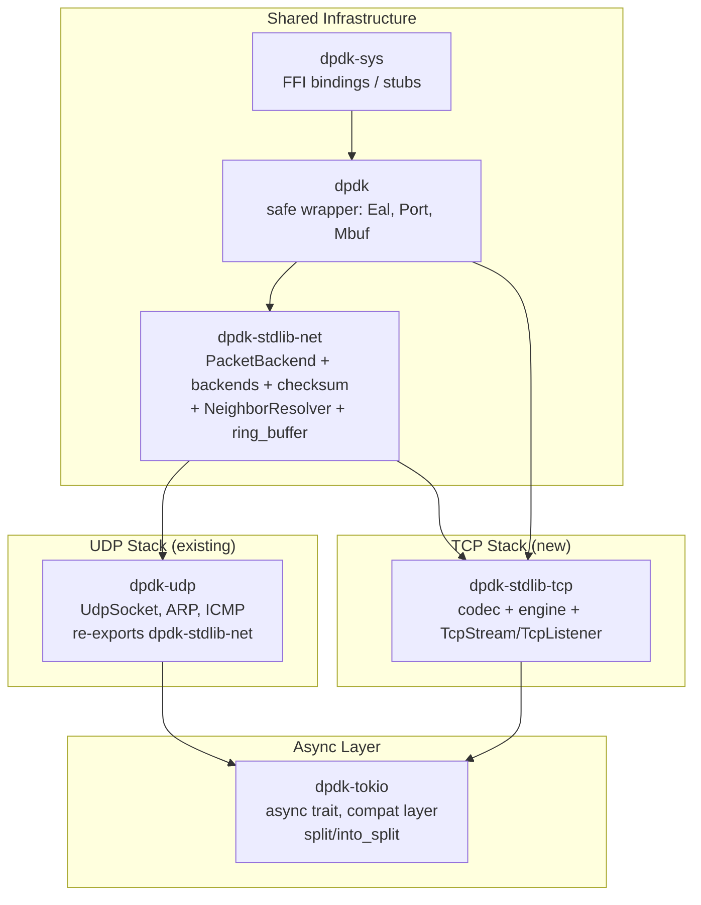
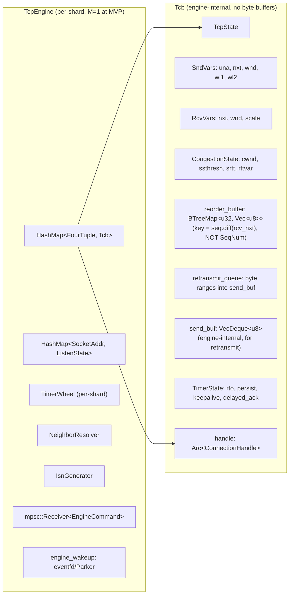

# Design Document: TCP Support

## Overview

This design describes a production-credible TCP implementation for dpdk-stdlib-rust, providing drop-in replacements for `std::net::TcpListener`, `std::net::TcpStream`, `tokio::net::TcpListener`, and `tokio::net::TcpStream`. The implementation bypasses the Linux kernel network stack using DPDK userspace networking while maintaining full API compatibility with the standard library.

The architecture is split into five layers:

1. **dpdk-stdlib-net** — Shared crate extracting `PacketBackend`, concrete backends, checksum helpers, and `NeighborResolver` so TCP does not depend on UDP
2. **dpdk-stdlib-tcp codec** — Pure stateless codec layer (`build_tcp_frame`/`parse_tcp_packet`) operating on `&[u8]`
3. **dpdk-stdlib-tcp engine** — Stateful protocol engine on a dedicated thread, owning all TCBs, servicing timers, implementing congestion control
4. **dpdk-stdlib-tcp socket API** — `TcpStream`/`TcpListener` providing `std::net`-compatible blocking API via shared SPSC rings
5. **dpdk-tokio compat** — Async `TcpStream`/`TcpListener` with per-TCB `AtomicWaker` for real `Poll::Pending`

### Key Design Decisions

- **SPSC ring concurrency model (Model A)**: User-facing byte streams live in lock-free SPSC rings shared between app and engine threads. The engine never exposes &mut self to app threads. Control ops route through an mpsc command channel.
- **Dedicated engine thread, shardable by construction**: Single engine thread at MVP (M=1), but FourTuple→shard routing by RSS hash is built in from day one. Scales to M shards later without architectural change.
- **Injectable Clock**: Enables deterministic testing of all timer-driven behavior without wall-clock sleeps.
- **Pure codec separated from stateful engine**: `on_segment` takes `ParsedTcpSegment` (not raw bytes), keeping the engine IP-version-agnostic.
- **Full dpdk-stdlib-net extraction**: Backends, checksum, neighbor resolution all move to dpdk-stdlib-net. CI enforces dpdk-stdlib-tcp never depends on dpdk-udp.
- **IPv6-readiness**: All APIs use `SocketAddr`, internal v4/v6 dispatch, factored pseudo-header checksum, reserved v6 names.
- **split/into_split in MVP**: OwnedReadHalf/OwnedWriteHalf (dominant tokio idiom, required by hyper/axum/tonic).
- **Accept-queue-full → RST**: Deliberate divergence from Linux (explicit rejection allows immediate client retry vs silent drop + SYN retransmit timeout).


## Architecture

### Crate Dependency Graph



### Engine Thread + SPSC Ring Architecture

```mermaid
graph TB
    subgraph "Application Threads"
        APP1[TcpStream::read<br/>pops from rx_ring<br/>parks on Condvar if empty]
        APP2[TcpStream::write<br/>pushes to tx_ring<br/>signals engine_wakeup]
        ASYNC[tokio task<br/>Poll::Pending + AtomicWaker]
        CMD[Control ops<br/>connect/listen/shutdown<br/>send via mpsc channel]
    end

    subgraph "Engine Thread"
        LOOP[Engine Loop: select on<br/>rx_ready | engine_wakeup | timer_deadline]
        RECV[recv_frames from backend]
        PARSE[parse_tcp_packet<br/>outside engine]
        ENGINE[TcpEngine::on_segment<br/>takes ParsedTcpSegment]
        TICK[TcpEngine::on_tick<br/>services all timers]
        CMDPROC[Process EngineCommands<br/>from mpsc channel]
        SEND[send_frame to backend]
        DRAIN[Drain tx_rings → retransmit queue<br/>Push to rx_rings from reorder buffer]
    end

    subgraph "Per-Connection (Arc&lt;ConnectionHandle&gt;)"
        RX[rx_ring: SpscRing&lt;u8&gt;<br/>engine → app]
        TX[tx_ring: SpscRing&lt;u8&gt;<br/>app → engine]
        STATE[state: AtomicU8<br/>TcpState]
        ERR[error: Mutex&lt;Option&lt;TcpError&gt;&gt;]
        CVAR[Condvar + notify_lock]
        RWAKER[read_waker: AtomicWaker]
        WWAKER[write_waker: AtomicWaker]
    end

    APP1 -->|"pop bytes"| RX
    APP2 -->|"push bytes"| TX
    APP2 -->|"signal"| LOOP
    CMD -->|"mpsc send"| CMDPROC
    RECV --> PARSE --> ENGINE
    TICK --> ENGINE
    CMDPROC --> ENGINE
    ENGINE -->|"push received data"| RX
    ENGINE -->|"pop app data for sending"| TX
    ENGINE --> SEND
    ENGINE -->|"update"| STATE
    ENGINE -->|"wake"| CVAR
    ENGINE -->|"wake"| RWAKER
    ENGINE -->|"wake"| WWAKER
    CVAR --> APP1
    RWAKER --> ASYNC
    WWAKER --> ASYNC
```

### Engine Internal Structure



## Components and Interfaces

### Component 1: dpdk-stdlib-net (Shared Crate — Full Extraction)

**What moves from dpdk-udp to dpdk-stdlib-net:**
- `PacketBackend` trait + `BackendConfig` + `BackendType`
- `DpdkBackend` (backend_dpdk.rs)
- `RawSocketBackend` (backend_raw.rs)
- `create_backend()` factory function
- `ring_buffer.rs` (PACKET_MMAP ring buffer)
- `ipv4_checksum()` + `pseudo_header_checksum()` helpers
- NEW: `NeighborResolver` trait + `ArpResolver` (factored from ArpHandler/ArpCache + RoutingTable + gateway-MAC rule)

**NeighborResolver trait:**

```rust
// dpdk-stdlib-net/src/neighbor.rs
pub trait NeighborResolver: Send + Sync {
    /// Resolve IP address to MAC address (may block briefly for ARP/NDP)
    fn resolve(&self, ip: IpAddr) -> io::Result<[u8; 6]>;
    /// Check if resolution is cached (non-blocking)
    fn lookup_cached(&self, ip: IpAddr) -> Option<[u8; 6]>;
}

/// IPv4 ARP-based resolver (factored from dpdk-udp's ArpHandler)
pub struct ArpResolver { /* ArpCache + RoutingTable + gateway_mac rule */ }
// NdpResolver (v1.1) will implement the same trait for IPv6
```

**Backward compatibility:** `dpdk-udp` re-exports all moved items:
```rust
// dpdk-udp/src/lib.rs
pub use dpdk_net::{PacketBackend, BackendConfig, BackendType, create_backend, ...};
```

**CI enforcement:** `cargo tree -p dpdk-stdlib-tcp --no-default-features -i dpdk-udp` must exit non-zero (R7.3).

### Component 2: dpdk-stdlib-tcp Codec

**Unchanged from previous design** except:
- `on_segment` no longer lives here — it's on the engine
- `tcp_checksum` takes `src_ip: &[u8], dst_ip: &[u8]` (parameterized for IPv6)
- MSS: `compute_mss(mtu, ip_header_len)` not hardcoded 1460

```rust
pub fn parse_tcp_packet(frame: &[u8]) -> Result<ParsedTcpSegment, TcpError>;
pub fn build_tcp_frame(params: &TcpFrameParams) -> Result<Vec<u8>, TcpError>;
pub fn build_tcp_packet(mbuf: &mut Mbuf, params: &TcpFrameParams) -> Result<(), TcpError>;
pub fn tcp_checksum(src_ip: &[u8], dst_ip: &[u8], tcp_segment: &[u8]) -> u16;
pub fn compute_mss(mtu: u16, ip_header_len: u16) -> u16;

pub const MAX_TCP_PAYLOAD: usize = 1460;    // MTU 1500 - 20 IPv4 - 20 TCP
pub const MAX_TCP_PAYLOAD_V6: usize = 1440; // MTU 1500 - 40 IPv6 - 20 TCP
```

### Component 3: dpdk-stdlib-tcp Engine

**Core change: on_segment takes ParsedTcpSegment, not raw bytes.**

```rust
pub struct TcpEngine {
    tcbs: HashMap<FourTuple, Tcb>,
    listeners: HashMap<SocketAddr, ListenState>,
    timer_wheel: TimerWheel,
    clock: Arc<dyn Clock>,
    config: EngineConfig,
    isn_generator: IsnGenerator,
    neighbor_resolver: Arc<dyn NeighborResolver>,
    shard_id: usize,  // For sharding (M=1 at MVP)
}

impl TcpEngine {
    /// Process parsed inbound segment (parse happens OUTSIDE engine)
    pub fn on_segment(&mut self, seg: &ParsedTcpSegment) -> Vec<Vec<u8>>;

    /// Service all timers + drain tx_rings + push to rx_rings
    pub fn on_tick(&mut self, now: Instant) -> Vec<Vec<u8>>;

    /// Process a control command from the app thread
    pub fn on_command(&mut self, cmd: EngineCommand) -> Vec<Vec<u8>>;
}
```

**ISN Generator (P0-4 fix: M computed from clock, not an undriven counter):**

```rust
pub struct IsnGenerator {
    secret: [u8; 16],       // Per-boot 128-bit key from getrandom
    boot_instant: Instant,  // Captured at engine start
}

impl IsnGenerator {
    pub fn new() -> Self {
        let mut secret = [0u8; 16];
        getrandom::getrandom(&mut secret).expect("getrandom failed");
        IsnGenerator { secret, boot_instant: Instant::now() }
    }

    pub fn generate(&self, four_tuple: &FourTuple, clock: &dyn Clock) -> SeqNum {
        // M = elapsed since boot in 4µs units (wraps ~4.7 hours, fine for ISN)
        let elapsed = clock.now().duration_since(self.boot_instant);
        let m = (elapsed.as_micros() / 4) as u32;
        // Hash the 4-tuple with the per-boot secret
        let hash = siphasher::sip::SipHasher24::new_with_key(&self.secret)
            .hash(&four_tuple.to_bytes());
        SeqNum(m.wrapping_add(hash as u32))
    }
}
```

**SeqNum (Ord FORBIDDEN):**

```rust
#[derive(Debug, Clone, Copy, PartialEq, Eq, Hash)]
pub struct SeqNum(pub u32);
// NOTE: Ord is intentionally NOT implemented — serial number comparison
// is non-transitive. Use lt/le/gt/in_range methods only.

impl SeqNum {
    pub fn lt(self, other: SeqNum) -> bool { ... }
    pub fn le(self, other: SeqNum) -> bool { ... }
    pub fn gt(self, other: SeqNum) -> bool { ... }
    pub fn add(self, offset: u32) -> SeqNum { ... }
    pub fn diff(self, other: SeqNum) -> u32 { ... }
    pub fn in_range(self, start: SeqNum, end: SeqNum) -> bool { ... }
}
```

**Reorder buffer (soundness fix):**
```rust
// Key is rebased offset from rcv_nxt (not SeqNum)
// Offsets are window-bounded (≤ rcv_wnd ≤ 2³⁰), so u32 Ord is total
reorder_buffer: BTreeMap<u32, Vec<u8>>,  // key = seg.seq.diff(rcv_nxt)
```

**CongestionState (with NewReno partial-ACK):**

```rust
pub struct CongestionState {
    pub cwnd: u32,
    pub ssthresh: u32,
    pub srtt: Option<Duration>,  // None until first sample
    pub rttvar: Option<Duration>,
    pub rto: Duration,           // Initial 1s
    pub in_recovery: bool,
    pub recovery_point: SeqNum,
    pub dup_ack_count: u32,
}

impl CongestionState {
    pub fn new(mss: u16) -> Self;
    pub fn initial_window(mss: u16) -> u32;
    pub fn update_rtt(&mut self, sample: Duration, is_first: bool);
    pub fn on_ack(&mut self, bytes_acked: u32, mss: u16);
    pub fn on_triple_dup_ack(&mut self, flight_size: u32, mss: u16);
    pub fn on_partial_ack(&mut self, bytes_acked: u32, mss: u16);
    pub fn on_recovery_exit(&mut self);
    pub fn effective_window(&self, rwnd: u32) -> u32;
}
```

**Karn's algorithm + first sample:**
```rust
fn update_rtt(&mut self, sample: Duration, is_first: bool) {
    if is_first {
        self.srtt = Some(sample);
        self.rttvar = Some(sample / 2);
    } else {
        let srtt = self.srtt.unwrap();
        let rttvar = self.rttvar.unwrap();
        // RTTVAR = (1-β) * RTTVAR + β * |SRTT - R|   (β = 1/4)
        let diff = if sample > srtt { sample - srtt } else { srtt - sample };
        self.rttvar = Some(rttvar * 3 / 4 + diff / 4);
        // SRTT = (1-α) * SRTT + α * R                (α = 1/8)
        self.srtt = Some(srtt * 7 / 8 + sample / 8);
    }
    self.rto = self.srtt.unwrap() + (self.rttvar.unwrap() * 4).max(Duration::from_millis(1));
    self.rto = self.rto.clamp(Duration::from_secs(1), Duration::from_secs(60));
}
// Never sample retransmitted segments (Karn's algorithm)
// Prefer timestamp-based RTT when timestamps are negotiated
```

**Delayed-ACK + Nagle:**
```rust
// Delayed-ACK: coalesce ACKs up to 200ms OR every-other-segment
// Timer type: TimerType::DelayedAck (200ms deadline)
// Nagle: if there is unacknowledged data AND the write is < MSS, buffer it
//         send immediately if: nodelay || no unacked data || write fills MSS
// Interaction: Nagle sender + delayed-ACK receiver → 200ms stall (documented)
```

**Persist timer (never aborts):**
```rust
// Unlike RTO which has max_retries → TimedOut, persist probes indefinitely.
// Persist sends 1-byte window probes at exponentially backed-off intervals
// (capped at 60s). A zero-window condition does NOT timeout the connection.
```

### Component 4: ConnectionHandle (Shared App↔Engine State)

**P0-A fix: SpscByteRing replaces SpscRing<u8>.** The existing `ring.rs` `SpscRing<T>` is a single-item generic ring (enqueue/dequeue) with no byte-stream API. TCP requires `write(&[u8]) -> usize` / `read(&mut [u8]) -> usize` semantics. A new `SpscByteRing` is introduced — a power-of-2 contiguous byte buffer with head/tail in bytes, using the same Acquire/Release discipline as `SpscRing`, providing partial-read/partial-write behavior that maps directly to TCP's stream semantics.

**P0-C fix: SPSC single-consumer invariant.** `SpscByteRing` is strictly single-producer/single-consumer. `into_split` (one reader half + one writer half) is the sole sound concurrent access pattern. `try_clone()` on the DPDK arm returns `io::Error::new(Unsupported, "try_clone not supported for DPDK TCP streams; use into_split()")` — this is a documented std-parity divergence (like accept-RST). Concurrent `(&stream).read()` from multiple threads is protected by a per-handle `read_mutex: Mutex<()>` that serializes reads without holding any TCB state.

**P0-E fix: Sticky error + explicit EOF.** `error` is peek-only (clone, never take). `eof: AtomicBool` is set by the engine after the final bytes are enqueued on FIN receipt. EOF detection uses `eof.load(Acquire)` — not enum ordering.

**P0-F fix: Drop → Close with app-side refcount.** `app_refcount: AtomicUsize` tracks the number of live app handles (TcpStream + split halves). Distinct from `Arc<ConnectionHandle>` strong_count (engine also holds a clone). When app_refcount reaches 0, `EngineCommand::Close` is sent, triggering FIN/TIME_WAIT cleanup. `OwnedWriteHalf::drop` sends `Shutdown(Write)` + decrements; `OwnedReadHalf::drop` only decrements. Honors SO_LINGER.

```rust
/// Shared between app threads and engine thread via Arc.
/// NOTE: dpdk-stdlib-tcp does NOT depend on tokio (CI-enforced: cargo tree -p dpdk-stdlib-tcp -i tokio must fail).
/// Channel primitives use std::sync::mpsc. Oneshot is Arc<(Mutex<Option<T>>, Condvar)>.
pub struct ConnectionHandle {
    // === Byte streams (P0-A: SpscByteRing, not SpscRing<u8>) ===
    /// Received data: engine writes, app reads. Power-of-2 byte ring.
    /// Sized from SO_RCVBUF at connection creation (default 64KB).
    pub rx_ring: SpscByteRing,
    /// Send data: app writes, engine reads. Power-of-2 byte ring.
    /// Sized from SO_SNDBUF at connection creation (default 64KB).
    pub tx_ring: SpscByteRing,

    // === State + lifecycle (P0-E: explicit eof, sticky error) ===
    /// Current TCP state (engine updates with Release ordering)
    pub state: AtomicU8,
    /// Explicit EOF flag — set by engine after final rx bytes enqueued on FIN.
    /// Readers check this with Acquire after finding rx_ring empty.
    pub eof: AtomicBool,
    /// Latched connection error — STICKY: peek/clone only, never take.
    /// Once set, all subsequent read/write/connect calls see it.
    pub error: Mutex<Option<TcpError>>,

    // === Blocking wake (P0-B: recheck-under-lock discipline) ===
    /// The Condvar + notify_lock implement correct blocking wake:
    /// - Reader: lock(notify_lock) → recheck(rx_ring/eof/error) → wait(guard)
    /// - Engine: enqueue bytes → lock(notify_lock) → notify_all() → unlock()
    /// This prevents the lost-wakeup race (P0-B).
    pub condvar: Condvar,
    pub notify_lock: Mutex<()>,

    // === Async wakers ===
    pub read_waker: AtomicWaker,
    pub write_waker: AtomicWaker,

    // === Concurrency guards (P0-C) ===
    /// Serializes concurrent (&stream).read() calls (std permits this).
    /// into_split is the preferred pattern; this Mutex is the fallback.
    pub read_mutex: Mutex<()>,
    /// Serializes concurrent (&stream).write() calls.
    pub write_mutex: Mutex<()>,

    // === Lifecycle (P0-F: app-side refcount for Drop→Close) ===
    /// Number of live app handles (TcpStream + split halves).
    /// Distinct from Arc strong_count (engine also holds a clone).
    /// When this reaches 0 → send EngineCommand::Close.
    pub app_refcount: AtomicUsize,
    /// Command sender for Close on last-handle-drop.
    pub cmd_tx: std::sync::mpsc::Sender<EngineCommand>,
    pub key: FourTuple,
    pub linger: Mutex<Option<Duration>>,

    // === Engine wakeup (P0-D: cmd_tx.send also signals) ===
    /// Engine wakeup signal. Triggered by:
    /// - tx_ring.write() (new data to send)
    /// - cmd_tx.send() (control operation — P0-D fix)
    pub engine_wakeup: Arc<EngineWakeup>,
}
```

**SpscByteRing API (P0-A):**
```rust
/// Lock-free single-producer/single-consumer byte ring buffer.
/// Power-of-2 capacity. head/tail are byte offsets (wrapping).
/// Producer: write(&[u8]) -> usize (returns bytes written, may be partial)
/// Consumer: read(&mut [u8]) -> usize (returns bytes read, may be partial)
/// Memory ordering: producer store(Release) on head; consumer load(Acquire) on head.
pub struct SpscByteRing {
    buf: Box<[u8]>,        // Power-of-2 capacity
    head: AtomicUsize,     // Write position (producer advances)
    tail: AtomicUsize,     // Read position (consumer advances)
    capacity: usize,       // buf.len() (power of 2)
}

impl SpscByteRing {
    pub fn new(capacity: usize) -> Self;          // capacity rounded up to power of 2
    pub fn write(&self, data: &[u8]) -> usize;    // Returns bytes written (0 if full)
    pub fn read(&self, buf: &mut [u8]) -> usize;  // Returns bytes read (0 if empty)
    pub fn available_read(&self) -> usize;        // Bytes available to read
    pub fn available_write(&self) -> usize;       // Space available to write
    pub fn is_empty(&self) -> bool;
}
```

**Memory ordering contract:**
- Engine: `rx_ring.write(data)` [Release on head] → `state.store(Release)` → `eof.store(Release)` → lock(notify_lock) → notify_all → unlock → `read_waker.wake()`
- App reader: `rx_ring.read(buf)` [Acquire on head]; if empty → `eof.load(Acquire)` → `error peek`
- This ensures bytes are visible before EOF/state signals.

**EngineWakeup (P0-D fix: cmd_tx.send is a wake source):**
```rust
/// Wraps an eventfd (Linux) or AtomicBool+Condvar (portable/test).
/// The cmd_tx sender is wrapped so that every send() also signals engine_wakeup.
/// This prevents cold-start deadlock (connect on idle engine).
pub struct CommandSender {
    inner: std::sync::mpsc::Sender<EngineCommand>,
    wakeup: Arc<EngineWakeup>,
}

impl CommandSender {
    pub fn send(&self, cmd: EngineCommand) -> Result<(), SendError<EngineCommand>> {
        let result = self.inner.send(cmd);
        self.wakeup.signal(); // Always wake engine after command send
        result
    }
}
```

**EngineCommand (std::sync::mpsc channel — no tokio dependency):**

```rust
pub enum EngineCommand {
    Connect {
        local: SocketAddr,
        remote: SocketAddr,
        src_mac: [u8; 6],       // Resolved in socket layer, threaded to engine
        dst_mac: [u8; 6],       // Resolved via NeighborResolver before command send
        handle: Arc<ConnectionHandle>,
        /// Fulfilled when state reaches Established or error occurs.
        /// Implemented as Arc<(Mutex<Option<Result<FourTuple, TcpError>>>, Condvar)> (no tokio oneshot).
        response: OneshotSender<Result<FourTuple, TcpError>>,
    },
    Listen {
        addr: SocketAddr,
        backlog: usize,
        handle: Arc<ConnectionHandle>,
        response: OneshotSender<Result<(), TcpError>>,
    },
    /// Accept uses oneshot (engine stashes Sender in ListenState, fulfils on next
    /// completed handshake → natural FIFO). No accept_ready AtomicBool needed.
    Accept {
        listen_addr: SocketAddr,
        response: OneshotSender<Result<(FourTuple, Arc<ConnectionHandle>), TcpError>>,
    },
    Shutdown {
        key: FourTuple,
        how: Shutdown,
    },
    SetOption {
        key: FourTuple,
        option: SocketOption,
    },
    Close {
        key: FourTuple,
        linger: Option<Duration>,
    },
}

/// Socket options that can be set via EngineCommand::SetOption.
/// Scalar options also mirrored into atomics on ConnectionHandle for lock-free getters.
pub enum SocketOption {
    Nodelay(bool),
    Keepalive(Option<KeepaliveConfig>),
    Linger(Option<Duration>),
    RecvBufSize(usize),  // Cannot resize ring post-creation; sets rwnd cap
    SendBufSize(usize),  // Cannot resize ring post-creation; sets cwnd cap
    ReuseAddr(bool),
    Ttl(u8),
    ReadTimeout(Option<Duration>),
    WriteTimeout(Option<Duration>),
    Nonblocking(bool),
}

/// Oneshot channel without tokio: Arc<(Mutex<Option<T>>, Condvar)>
pub struct OneshotSender<T> { /* ... */ }
pub struct OneshotReceiver<T> { /* ... */ }
```

**connect_v4 with NeighborResolver call site (P0-4 fix):**
```rust
fn connect_v4(addr: SocketAddr) -> io::Result<DpdkTcpStream> {
    let handle = Arc::new(ConnectionHandle::new(/* config */));
    handle.app_refcount.store(1, Ordering::Release);
    let cmd_tx = CommandSender::new(ENGINE_CMD_TX.clone(), handle.engine_wakeup.clone());

    // Resolve destination MAC via NeighborResolver (ARP + gateway-MAC rule).
    // This happens in the SOCKET LAYER, keeping the engine MAC-agnostic.
    let dst_mac = NEIGHBOR_RESOLVER.resolve(addr.ip())?;
    let src_mac = BACKEND.mac_address();

    let (response_tx, response_rx) = oneshot_channel();
    cmd_tx.send(EngineCommand::Connect {
        local: SocketAddr::V4(/* ephemeral port */),
        remote: addr,
        src_mac,       // Thread resolved MACs into the command
        dst_mac,       // so the engine can build frames immediately
        handle: handle.clone(),
        response: response_tx,
    })?;

    // Park until Established or error (connect_timeout version uses wait_timeout)
    let key = response_rx.recv()?;
    Ok(DpdkTcpStream { handle, cmd_tx, key })
}
```

### Component 5: TcpStream / TcpListener (Sync API)

```rust
pub struct TcpStream {
    inner: TcpStreamInner,
}

enum TcpStreamInner {
    Dpdk(DpdkTcpStream),
    Std(std::net::TcpStream),  // IPv6 fallback
}

struct DpdkTcpStream {
    handle: Arc<ConnectionHandle>,
    cmd_tx: mpsc::Sender<EngineCommand>,
    key: FourTuple,
}
```

**Blocking read (P0-B fix: recheck under the lock the engine notifies under):**
```rust
impl io::Read for TcpStream {
    fn read(&mut self, buf: &mut [u8]) -> io::Result<usize> {
        let _read_guard = self.handle.read_mutex.lock().unwrap(); // P0-C: serialize
        loop {
            // 1. Check sticky error (peek, never take)
            if let Some(err) = self.handle.error.lock().unwrap().as_ref() {
                return Err(err.clone().into());
            }
            // 2. Try non-blocking read from rx_ring
            let n = self.handle.rx_ring.read(buf);
            if n > 0 { return Ok(n); }
            // 3. Check explicit EOF (P0-E: not keyed on enum ordering)
            if self.handle.eof.load(Ordering::Acquire) {
                return Ok(0);
            }
            // 4. P0-B FIX: Lock notify_lock, RECHECK readiness under it, THEN wait.
            //    Engine does: enqueue → lock(notify_lock) → notify_all → unlock.
            //    This ensures no lost wakeup between step 2/3 and wait.
            let guard = self.handle.notify_lock.lock().unwrap();
            // Recheck under the lock:
            if self.handle.rx_ring.available_read() > 0
                || self.handle.eof.load(Ordering::Acquire)
                || self.handle.error.lock().unwrap().is_some()
            {
                drop(guard);
                continue; // Re-enter loop to handle the condition
            }
            // 5. Park (NOT holding any TCB lock, only notify_lock which guards nothing)
            // TODO: honor read_timeout via condvar.wait_timeout
            // TODO: honor set_nonblocking via WouldBlock return
            let _guard = self.handle.condvar.wait(guard).unwrap();
        }
    }
}
```

**impl Read/Write for &TcpStream (std parity, serialized via read_mutex/write_mutex — P0-C):**
```rust
impl io::Read for &TcpStream { /* acquires read_mutex, delegates to inner */ }
impl io::Write for &TcpStream { /* acquires write_mutex, delegates to inner */ }
// NOTE: try_clone() on DPDK arm returns Unsupported (documented divergence).
// into_split is the sole sound concurrent access pattern for SPSC.
```

**Internal v4/v6 dispatch:**
```rust
impl TcpStream {
    pub fn connect<A: ToSocketAddrs>(addr: A) -> io::Result<TcpStream> {
        let addr = resolve_addr(addr)?;
        match addr {
            SocketAddr::V4(_) => Ok(TcpStream { inner: TcpStreamInner::Dpdk(Self::connect_v4(addr)?) }),
            SocketAddr::V6(_) => Ok(TcpStream { inner: TcpStreamInner::Std(std::net::TcpStream::connect(addr)?) }),
        }
    }
}
```

**split/into_split (MVP, P0-F: Drop→Close with app_refcount):**
```rust
pub struct OwnedReadHalf { handle: Arc<ConnectionHandle> }
pub struct OwnedWriteHalf { handle: Arc<ConnectionHandle> }

impl Drop for OwnedWriteHalf {
    fn drop(&mut self) {
        // Send Shutdown(Write) — triggers FIN. Then decrement app_refcount.
        let _ = self.handle.cmd_tx.send(EngineCommand::Shutdown {
            key: self.handle.key, how: Shutdown::Write
        });
        self.handle.engine_wakeup.signal();
        if self.handle.app_refcount.fetch_sub(1, Ordering::AcqRel) == 1 {
            // Last handle — send Close to trigger FIN/TIME_WAIT cleanup
            let linger = self.handle.linger.lock().unwrap().clone();
            let _ = self.handle.cmd_tx.send(EngineCommand::Close {
                key: self.handle.key, linger
            });
            self.handle.engine_wakeup.signal();
        }
    }
}

impl Drop for OwnedReadHalf {
    fn drop(&mut self) {
        if self.handle.app_refcount.fetch_sub(1, Ordering::AcqRel) == 1 {
            let linger = self.handle.linger.lock().unwrap().clone();
            let _ = self.handle.cmd_tx.send(EngineCommand::Close {
                key: self.handle.key, linger
            });
            self.handle.engine_wakeup.signal();
        }
    }
}

impl Drop for DpdkTcpStream {
    fn drop(&mut self) {
        // P0-F: Drop sends Close when last app handle
        if self.handle.app_refcount.fetch_sub(1, Ordering::AcqRel) == 1 {
            let linger = self.handle.linger.lock().unwrap().clone();
            let _ = self.handle.cmd_tx.send(EngineCommand::Close {
                key: self.handle.key, linger
            });
            self.handle.engine_wakeup.signal();
        }
    }
}

impl TcpStream {
    pub fn into_split(self) -> (OwnedReadHalf, OwnedWriteHalf) {
        // app_refcount starts at 1 for the TcpStream; into_split replaces it with 2
        self.handle.app_refcount.store(2, Ordering::Release);
        let rh = OwnedReadHalf { handle: self.handle.clone() };
        let wh = OwnedWriteHalf { handle: self.handle.clone() };
        std::mem::forget(self); // Don't trigger DpdkTcpStream::drop (which would Close)
        (rh, wh)
    }
}
```

**Flush-before-FIN:** When `Shutdown(Write)` is processed by the engine, it sets a `fin_pending` flag on the Tcb. The engine drains `tx_ring` fully into `send_buf`, segments and transmits all data, THEN emits FIN. This prevents data loss on the common `write() → shutdown(Write)` pattern (hyper/axum).

**try_clone() — documented divergence:**
```rust
impl TcpStream {
    pub fn try_clone(&self) -> io::Result<TcpStream> {
        match &self.inner {
            TcpStreamInner::Dpdk(_) => Err(io::Error::new(
                io::ErrorKind::Unsupported,
                "try_clone not supported for DPDK TCP streams; use into_split()"
            )),
            TcpStreamInner::Std(s) => Ok(TcpStream {
                inner: TcpStreamInner::Std(s.try_clone()?)
            }),
        }
    }
}
```

### Component 6: Async TCP Compat Layer

**Register-first-then-recheck (no lost wakeup — mirrors sync P0-B/E fixes):**
```rust
impl AsyncRead for TcpStream {
    fn poll_read(self: Pin<&mut Self>, cx: &mut Context<'_>, buf: &mut ReadBuf<'_>) -> Poll<io::Result<()>> {
        match &self.inner {
            TcpStreamInner::Dpdk(dpdk) => {
                // 1. Register waker FIRST (before any state check)
                dpdk.handle.read_waker.register(cx.waker());

                // 2. Check sticky error (peek/clone, NEVER take — P0-E)
                if let Some(err) = dpdk.handle.error.lock().unwrap().as_ref() {
                    return Poll::Ready(Err(err.clone().into()));
                }

                // 3. Try non-blocking read from SpscByteRing (P0-A: .read(), not .pop())
                let n = dpdk.handle.rx_ring.read(buf.initialize_unfilled());
                if n > 0 {
                    buf.advance(n);
                    return Poll::Ready(Ok(()));
                }

                // 4. Check explicit EOF (P0-E: eof flag, NOT enum ordering)
                if dpdk.handle.eof.load(Ordering::Acquire) {
                    return Poll::Ready(Ok(())); // EOF — FIN received, all bytes drained
                }

                // 5. Waker is registered (step 1), ring is empty, not EOF → Pending
                // Engine will wake via read_waker after delivering data or setting eof/error
                Poll::Pending
            }
            TcpStreamInner::Tokio(tokio_stream) => {
                Pin::new(tokio_stream).poll_read(cx, buf)
            }
        }
    }
}

impl AsyncWrite for TcpStream {
    fn poll_write(self: Pin<&mut Self>, cx: &mut Context<'_>, data: &[u8]) -> Poll<io::Result<usize>> {
        match &self.inner {
            TcpStreamInner::Dpdk(dpdk) => {
                // 1. Register waker FIRST
                dpdk.handle.write_waker.register(cx.waker());

                // 2. Check sticky error
                if let Some(err) = dpdk.handle.error.lock().unwrap().as_ref() {
                    return Poll::Ready(Err(err.clone().into()));
                }

                // 3. Try non-blocking write to SpscByteRing
                let n = dpdk.handle.tx_ring.write(data);
                if n > 0 {
                    dpdk.handle.engine_wakeup.signal(); // Wake engine to pick up data
                    return Poll::Ready(Ok(n));
                }

                // 4. Ring full → Pending (engine will wake after draining)
                Poll::Pending
            }
            TcpStreamInner::Tokio(tokio_stream) => {
                Pin::new(tokio_stream).poll_write(cx, data)
            }
        }
    }

    fn poll_flush(self: Pin<&mut Self>, cx: &mut Context<'_>) -> Poll<io::Result<()>> {
        match &self.inner {
            TcpStreamInner::Dpdk(_) => Poll::Ready(Ok(())), // Flush = hand-off (don't block on ACK)
            TcpStreamInner::Tokio(s) => Pin::new(s).poll_flush(cx),
        }
    }

    fn poll_shutdown(self: Pin<&mut Self>, cx: &mut Context<'_>) -> Poll<io::Result<()>> {
        match &self.inner {
            TcpStreamInner::Dpdk(dpdk) => {
                // Send Shutdown(Write) command — engine will drain tx_ring then FIN
                let _ = dpdk.handle.cmd_tx.send(EngineCommand::Shutdown {
                    key: dpdk.handle.key, how: Shutdown::Write
                });
                dpdk.handle.engine_wakeup.signal();
                Poll::Ready(Ok(()))
            }
            TcpStreamInner::Tokio(s) => Pin::new(s).poll_shutdown(cx),
        }
    }
}
```

### Component 7: Engine Loop (the runtime)

```rust
fn engine_loop(
    backend: Arc<dyn PacketBackend>,
    engine: &mut TcpEngine,
    cmd_rx: mpsc::Receiver<EngineCommand>,
    wakeup: Arc<EngineWakeup>,
) {
    loop {
        // Wait for: rx frames ready | engine_wakeup signaled | next timer deadline
        let deadline = engine.next_timer_deadline();
        let event = wait_for_event(backend.as_ref(), &wakeup, deadline);

        match event {
            Event::RxReady => {
                let frames = backend.recv_frames(32).unwrap_or_default();
                for frame in &frames {
                    if let Ok(seg) = parse_tcp_packet(frame) {
                        let outbound = engine.on_segment(&seg);
                        for out in outbound { backend.send_frame(&out).ok(); }
                    }
                }
            }
            Event::Wakeup | Event::Timeout => {}
        }

        // Process pending commands
        while let Ok(cmd) = cmd_rx.try_recv() {
            let outbound = engine.on_command(cmd);
            for out in outbound { backend.send_frame(&out).ok(); }
        }

        // Service timers + drain tx_rings
        let now = engine.clock.now();
        let outbound = engine.on_tick(now);
        for out in outbound { backend.send_frame(&out).ok(); }
    }
}
```

**In cargo test (stub backend):** The engine loop uses condvar-based wait (not busy-spin). MockClock advances time explicitly; `wait_for_event` returns immediately when mock time advances.

**Backend rx_readiness (honest about poll-mode):**
```rust
/// Backends declare their wake capability — the engine loop adapts accordingly.
pub enum RxReadiness {
    /// Backend has a pollable fd (AF_PACKET) — engine can epoll/select on it.
    Fd(RawFd),
    /// Backend is poll-only (DPDK rx_burst) — engine thread busy-polls.
    /// This is a dedicated core cost, normal for kernel-bypass. Documented trade-off.
    PollOnly,
    /// Stub/test backend — engine uses condvar wait, explicitly not busy-poll.
    Condvar(Arc<(Mutex<bool>, Condvar)>),
}

// PacketBackend gains:
fn rx_readiness(&self) -> RxReadiness;
```

**Engine loop wait_for_event (P0-D: cmd channel is a wake source):**
- DPDK (PollOnly): busy-poll `recv_frames` + check `cmd_rx.try_recv()` + check `engine_wakeup` on every iteration. Dedicated core.
- AF_PACKET (Fd): `epoll_wait(rx_fd, engine_wakeup_fd, cmd_ready_fd, timeout=next_timer_deadline)`
- Stub (Condvar): `condvar.wait_timeout(next_timer_deadline)`, woken by test harness or `engine_wakeup.signal()` from `cmd_tx.send()` or `tx_ring.write()`


## Data Models

### Tcb (Engine-Internal — NO user-facing byte buffers)

```rust
pub struct Tcb {
    pub key: FourTuple,
    pub state: TcpState,

    // Send sequence variables (RFC 9293 §3.3.1)
    pub snd_una: SeqNum,
    pub snd_nxt: SeqNum,
    pub snd_wnd: u32,       // Peer's window (already scaled)
    pub snd_wl1: SeqNum,
    pub snd_wl2: SeqNum,
    pub iss: SeqNum,

    // Receive sequence variables
    pub rcv_nxt: SeqNum,
    pub rcv_wnd: u32,
    pub irs: SeqNum,

    // Window scaling
    pub snd_scale: u8,      // Peer's scale factor (left-shift their window)
    pub rcv_scale: u8,      // Our scale factor (right-shift when encoding)

    // MSS
    pub local_mss: u16,
    pub peer_mss: u16,      // Default 536 if no option

    // Congestion control
    pub congestion: CongestionState,

    // Timers
    pub rto_deadline: Option<Instant>,
    pub persist_deadline: Option<Instant>,
    pub keepalive_deadline: Option<Instant>,
    pub time_wait_deadline: Option<Instant>,
    pub fin_wait2_deadline: Option<Instant>,
    pub delayed_ack_deadline: Option<Instant>,
    pub retransmit_count: u32,

    // Engine-internal buffers (NOT shared with app)
    pub send_buf: VecDeque<u8>,         // Data from tx_ring waiting to be segmented
    pub retransmit_queue: Vec<RetransmitEntry>,  // Byte ranges into send_buf
    pub reorder_buffer: BTreeMap<u32, Vec<u8>>,  // key = seq.diff(rcv_nxt)

    // Nagle state
    pub nodelay: bool,
    pub has_unacked_data: bool,

    // Socket options
    pub keepalive: Option<KeepaliveConfig>,
    pub linger: Option<Duration>,
    pub recv_buf_size: usize,
    pub send_buf_size: usize,
    pub reuseaddr: bool,
    pub ttl: u8,

    // MAC addresses for frame building
    pub src_mac: [u8; 6],
    pub dst_mac: [u8; 6],

    // Shared handle (app↔engine bridge)
    pub handle: Arc<ConnectionHandle>,
}

pub struct RetransmitEntry {
    pub seq: SeqNum,
    pub offset: usize,      // Offset into send_buf (byte range, not copy)
    pub len: usize,
    pub sent_at: Instant,
    pub retransmit_count: u32,
}
```

### TcpError Enum

```rust
#[derive(Debug, Clone, thiserror::Error)]
pub enum TcpError {
    #[error("connection refused")]
    ConnectionRefused,
    #[error("connection reset")]
    ConnectionReset,
    #[error("connection aborted")]
    ConnectionAborted,
    #[error("broken pipe")]
    BrokenPipe,
    #[error("not connected")]
    NotConnected,
    #[error("operation timed out")]
    TimedOut,
    #[error("address already in use")]
    AddrInUse,
    #[error("address not available")]
    AddrNotAvailable,
    #[error("invalid packet: {0}")]
    InvalidPacket(String),
    #[error("resource limit exceeded: {0}")]
    ResourceLimit(String),
}

impl From<TcpError> for std::io::Error {
    fn from(e: TcpError) -> Self {
        let kind = match &e {
            TcpError::ConnectionRefused => io::ErrorKind::ConnectionRefused,
            TcpError::ConnectionReset => io::ErrorKind::ConnectionReset,
            TcpError::ConnectionAborted => io::ErrorKind::ConnectionAborted,
            TcpError::BrokenPipe => io::ErrorKind::BrokenPipe,
            TcpError::NotConnected => io::ErrorKind::NotConnected,
            TcpError::TimedOut => io::ErrorKind::TimedOut,
            TcpError::AddrInUse => io::ErrorKind::AddrInUse,
            TcpError::AddrNotAvailable => io::ErrorKind::AddrNotAvailable,
            TcpError::InvalidPacket(_) => io::ErrorKind::InvalidData,
            TcpError::ResourceLimit(_) => io::ErrorKind::Other,
        };
        io::Error::new(kind, e)
    }
}
```

### FourTuple

```rust
#[derive(Debug, Clone, Copy, Hash, PartialEq, Eq)]
pub struct FourTuple {
    pub local: SocketAddr,   // SocketAddr (not SocketAddrV4) for IPv6 readiness
    pub remote: SocketAddr,
}
```

## Throughput & Scaling

### MVP: Single Engine Thread (M=1)

At MVP, a single engine thread processes all connections. This is a deliberate tradeoff:
- **Simplicity**: One thread, one timer wheel, one TCB map. No cross-shard coordination.
- **Sufficient for latency parity**: The goal at MVP is latency/overhead parity with kernel TCP, not raw throughput parity (which requires multi-core parallelism).
- **R3 reframing**: Performance tests (R3) measure per-connection latency, connection establishment rate, and single-stream throughput. These don't require multi-core scaling.

### Shardable by Construction (M>1 future)

The design is structured so scaling to M shards requires no architectural change:
- **FourTuple → shard routing**: `shard_id = rss_hash(four_tuple) % M`. At M=1 this is trivially shard 0.
- **Per-shard state**: Each shard has its own `TcpEngine` instance with own TCB map, timer wheel, backend rx queue.
- **Per-shard thread**: Each shard runs its own engine loop.
- **No cross-shard communication**: Connections are pinned to a shard for their lifetime.

When throughput parity with multi-core kernel TCP is needed (v1.1+), the change is: increase M, assign RX queues to shards via RSS, spawn M engine threads.

## Correctness Properties

### Property 1: Codec round-trip

*For any* valid TCP segment, `parse_tcp_packet(build_tcp_frame(params))` produces equivalent fields including all parsed options.

**Validates: Requirements 8.4, 8.5**

### Property 2: Codec Mbuf equivalence

*For any* TcpFrameParams, `build_tcp_frame` and `build_tcp_packet` produce byte-identical frames.

**Validates: Requirements 8.1, 8.3**

### Property 3: Invalid frame rejection

*For any* frame < 54 bytes OR with data-offset < 5 OR data-offset*4 > frame length, `parse_tcp_packet` returns error.

**Validates: Requirements 8.7**

### Property 4: SYN required options

*For any* SYN/SYN-ACK frame built by the codec, the options field contains MSS, WScale, SACK-Perm, Timestamps.

**Validates: Requirements 8.8, 11.1, 11.2**

### Property 5: MSS segment bound

The engine never emits a segment with payload > min(local_mss, peer_mss). Peer MSS defaults to 536 if no option.

**Validates: Requirements 8.10, 11.5**

### Property 6: TCP checksum validity

*For any* valid segment + IPv4 addresses, computing checksum then validating yields 0xFFFF. Single-bit flip causes validation failure.

**Validates: Requirements 4.10, 4.11**

### Property 7: Sequence arithmetic transitivity

*For any* a < b < c in serial space, a < c holds. *For any* n, n < n+1 holds.

**Validates: Requirements 4.16**

### Property 8: State machine validity

*For any* sequence of valid TCP events from any initial state, the resulting state is always one of the 11 defined TcpState values.

**Validates: Requirements 4.1**

### Property 9: In-order data produces cumulative ACK correctness

*For any* in-order segment(s), the engine produces ACK with ack_num == rcv_nxt + total_payload_len. (Note: may be delayed up to 200ms or every-other-segment due to delayed-ACK.)

**Validates: Requirements 4.5**

### Property 10: Out-of-order produces duplicate ACK

*For any* out-of-order segment within the window, the engine produces a dup-ACK with ack_num == rcv_nxt.

**Validates: Requirements 4.6**

### Property 11: Timer-driven segment generation

*For any* expired timer, on_tick produces at least one outbound segment without preceding app call.

**Validates: Requirements 5.4**

### Property 12: TIME_WAIT and FIN_WAIT_2 cleanup

After 2*MSL in TIME_WAIT the TCB transitions to CLOSED. After fin_wait2_timeout in FIN_WAIT_2 the TCB is cleaned up.

**Validates: Requirements 4.14, 4.15**

### Property 13: Resource limit enforcement

At max_tcbs a new SYN produces RST. At accept backlog capacity a new SYN produces RST.

**Validates: Requirements 5.6, 12.1, 12.2**

### Property 14: RST validation per RFC 5961

Exact seq causes abort. In-window non-exact causes challenge ACK. Out-of-window causes silent drop.

**Validates: Requirements 4.12, 12.4**

### Property 15: Flight-size invariant

Unacked bytes (snd_nxt - snd_una) never exceed min(cwnd, rwnd).

**Validates: Requirements 6.4**

### Property 16: Congestion window slow-start

In slow-start (cwnd < ssthresh), each ACK increases cwnd by MSS.

**Validates: Requirements 6.1**

### Property 17: Initial window

IW = min(10*MSS, max(2*MSS, 14600)) for any MSS.

**Validates: Requirements 6.3**

### Property 18: Fast retransmit formula

On 3 dup-ACKs: ssthresh = max(flight/2, 2*MSS), cwnd = ssthresh + 3*MSS.

**Validates: Requirements 6.5**

### Property 19: TcpError to io::Error mapping

Every TcpError variant maps to the specified io::ErrorKind.

**Validates: Requirements 14.2**

### Property 20: AtomicWaker signaling with register-first-then-recheck

When engine delivers data to rx_ring AND a read_waker is registered, the waker is called. No data can arrive between register and recheck without a wake.

**Validates: Requirements 5.5, 10.6**

### Property 21: Reorder buffer soundness

*For any* sequence of out-of-order segments including segments that wrap the 2 to the 32 boundary, reassembly using the rebased-offset key produces byte-identical output to a reference in-order assembly.

**Validates: Requirements 4.5, 4.16**

### Property 22: Partial-ACK in recovery

*For any* partial ACK during fast recovery (snd_una advances but less than recovery_point), cwnd is deflated by bytes acked, the segment at new snd_una is retransmitted, and recovery continues (does not exit).

**Validates: Requirements 6.5**

### Property 23: Window scaling encoding round-trip

*For any* window value and scale factor, encoding (right-shift by rcv_scale) then decoding (left-shift by snd_scale) produces a value that correctly bounds the effective send window to the intended receiver buffer size.

**Validates: Requirements 11.3, 11.4**

### Property 24: SPSC ring data integrity

*For any* sequence of bytes pushed to tx_ring by the app and popped by the engine (or pushed to rx_ring by engine and popped by app), the byte sequence is preserved exactly with no reordering, duplication, or loss.

**Validates: Requirements 9.4, 9.5**

### Property 25: Persist never aborts

*For any* zero-window duration (even exceeding max RTO retries), the persist timer sends probes indefinitely without surfacing TimedOut.

**Validates: Requirements 4.9**

## Error Handling

| Component | Error Condition | Behavior | Error Type |
|-----------|----------------|----------|------------|
| Codec | Frame too short / invalid data-offset | Return Err(InvalidPacket) | TcpError |
| Codec | Checksum failure | Return Err(InvalidPacket) | TcpError |
| Engine | SYN to closed port | Send RST | Network |
| Engine | SYN at max TCBs | Send RST | Network |
| Engine | SYN at accept queue capacity | Send RST (deliberate, documented) | Network |
| Engine | RST received (exact seq) | Abort, latch ConnectionReset | TcpError |
| Engine | RST received (in-window) | Challenge ACK | Network |
| Engine | RST received (out-of-window) | Drop silently | Silent |
| Engine | RST in response to SYN | Latch ConnectionRefused | TcpError |
| Engine | RTO max retries exceeded | Abort, latch TimedOut | TcpError |
| Engine | Persist timer fires | Send 1-byte probe (NEVER aborts) | Network |
| Engine | Write after peer RST | Latch ConnectionReset | TcpError |
| Engine | Write after peer FIN | Latch BrokenPipe | TcpError |
| TcpStream | Read on closed (FIN received) | Return Ok(0) (EOF) | io::Result |
| TcpStream | Connect timeout | Return Err(TimedOut) | io::Error |
| TcpStream | Bind to in-use address | Return Err(AddrInUse) | io::Error |
| Async | Poll when error latched | Return Poll::Ready(Err) | io::Error |

## Testing Strategy

### Local (cargo test, no AWS)

| Category | Component | Strategy | Framework |
|----------|-----------|----------|-----------|
| Codec round-trip | dpdk-stdlib-tcp codec | Property-based (256+ cases) | proptest |
| Sequence arithmetic | dpdk-stdlib-tcp seq | Property-based | proptest |
| Reorder buffer soundness | dpdk-stdlib-tcp engine | Property-based (wrap boundary) | proptest |
| Checksum validity | dpdk-stdlib-tcp codec | Property-based | proptest |
| State machine | dpdk-stdlib-tcp engine | Property-based + MockClock | proptest |
| Congestion formulas | dpdk-stdlib-tcp congestion | Property-based | proptest |
| Timer behavior | dpdk-stdlib-tcp engine | Example-based with MockClock | #[test] |
| SPSC ring integrity | dpdk-stdlib-tcp | Property-based (multi-thread) | proptest |
| Error mapping | dpdk-stdlib-tcp error | Exhaustive | #[test] |
| Window scaling | dpdk-stdlib-tcp engine | Property-based | proptest |
| Partial-ACK | dpdk-stdlib-tcp congestion | Property-based (two-loss) | proptest |
| ISN randomization | dpdk-stdlib-tcp engine | Statistical (non-trivial) | #[test] |
| Synthetic benchmark | tcp-synthetic-bench | Mock backend | binary |

### AWS (EC2 Integration, auto on PR)

| Test | Infrastructure | Tier |
|------|---------------|------|
| Three-way handshake DPDK↔DPDK | EC2 dual-ENI | TCP-1 |
| Bidirectional transfer | EC2 dual-ENI | TCP-1 |
| Graceful FIN | EC2 dual-ENI | TCP-1 |
| Retransmission (loss injection) | EC2 dual-ENI | TCP-2 |
| Flow control (zero-window) | EC2 dual-ENI | TCP-2 |
| Kernel interop (ncat/iperf3) | EC2 dual-ENI | TCP-3 |
| std-parity (byte-for-byte + ErrorKind) | EC2 dual-ENI | TCP-3 |

### AWS (TRex Performance, manual trigger)

| Test | Infrastructure | Trigger |
|------|---------------|---------|
| Throughput (64/512/1400/65536B) | EC2 + TRex | workflow_dispatch |
| Latency (P50/P90/P99 echo) | EC2 + TRex | workflow_dispatch |
| Connection rate (CPS) | EC2 + TRex | workflow_dispatch |

